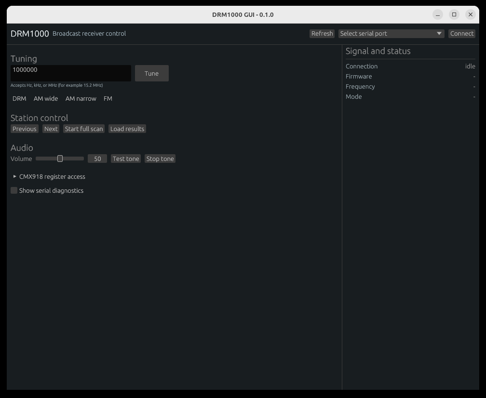

# DRM1000 GUI

Cross-platform Rust desktop and command-line controller for the CML Micro
DRM1000 broadcast receiver module.

The application uses the DRM1000's 921,600-baud UART through a host virtual
serial adapter. It provides the same controls through a native `egui` desktop
interface and command-line subcommands.

## Screenshot



## Features

- Frequency entry in Hz, kHz, or MHz and direct tuning
- DRM, AM wide, AM narrow, and FM controls
- Full-band scan, progress, result loading, service selection, and station up/down
- Volume and AM audio test-tone controls
- Continuous RSSI, DRM synchronization, MER, frequency-offset, service, and text display
- Four station preset recall/store slots from the CLI
- Guarded CMX918 register reads and writes
- Serial-port discovery and firmware-version probing
- Native Linux, Windows, and macOS support through `eframe` and `tokio-serial`

Firmware `v0.17` does not implement the newer scanner-percentage command. The
GUI therefore shows an indeterminate scan indicator and polls demodulator mode
and station results as a compatibility fallback. Newer firmware also displays
the reported percentage. A completed scan with no stations also closes the
scan state instead of leaving the indicator active.

## Hardware Connection

The DRM1000 does not provide USB itself. A USB-to-UART serial converter is
required. The converter must support `921600` baud, 8 data bits, no parity, and
1 stop bit (`8-N-1`). It must also be electrically compatible with the
DRM1000's 3.1 V CMOS UART. Do not use RS-232 voltage levels or a 5 V TTL UART.
If the converter TX voltage is not specified as compatible with 3.1 V logic,
use an appropriate level shifter.

Connect the converter and module with crossed transmit/receive signals:

| USB-to-UART converter | DRM1000 module | Direction |
| --- | --- | --- |
| RXD | Pin 32, `UART_TX` | DRM1000 to computer |
| TXD | Pin 33, `UART_RX` | Computer to DRM1000 |
| GND | Pin 30, `GND` | Common reference |

Any DRM1000 GND pin may be used, but pin 30 is adjacent to the UART pins. Do
not connect the converter's 5 V or 3.3 V supply output to the UART pins. A bare
DRM1000 module needs a separate nominal 3.1 V supply on pin 7 (`VDD_3V1`) and
ground; the DE9180 board supplies the module through its own power input. Pin
41 (`VDD_PA`) is a separate speaker-amplifier supply connection and is not
needed for UART communication.

Power the DRM1000 and allow its supply to stabilize before the converter drives
pin 33. The datasheet warns that driving `UART_RX` before module power is
present can damage the module or cause inconsistent behavior. An adapter or
level shifter with output enable can enforce this sequence. Pin 31,
`1V8_MONITOR`, indicates that the internal rail is active, but must not be used
as a power source.

The GUI deliberately does not automatically connect to an arbitrary serial
port. Select the adapter and press **Connect**. A device description containing
`DRM` or `DE9180` is preselected when available.

The application disables any status stream left active by an earlier session
before initializing the UART. On a clean GUI disconnect or exit it also
disables status and text output, preventing asynchronous data from confusing a
later connection.

Frequency readback updates the editor only while it is untouched. Once typing
begins, the draft remains stable until **Tune** is submitted. Volume readback
is similarly tied only to volume responses; note that firmware rounds the
requested 0-100 value to its nearest internally supported step.

## Run

```bash
cargo run --bin drm1000-gui
```

List ports and probe a receiver:

```bash
cargo run -- ports
cargo run -- --port /dev/ttyUSB0 probe
```

On Windows, replace `/dev/ttyUSB0` with a port such as `COM3`. On macOS, use
the corresponding `/dev/cu.*` device. The `probe` command performs the
documented `UART_INIT` handshake and then reads firmware version, frequency,
mode, and volume without changing receiver configuration.

Representative CLI operations:

```bash
drm1000-gui --port /dev/ttyUSB0 tune "15.2 MHz"
drm1000-gui --port /dev/ttyUSB0 mode drm
drm1000-gui --port /dev/ttyUSB0 scan 0
drm1000-gui --port /dev/ttyUSB0 stations
drm1000-gui --port /dev/ttyUSB0 volume 65
drm1000-gui --port /dev/ttyUSB0 status
drm1000-gui --port /dev/ttyUSB0 register-read 3d
drm1000-gui --port /dev/ttyUSB0 register-write 3d 55 --confirm
```

The audio test tone is provided by the module only in AM mode. In the GUI,
starting the tone at an MF/HF frequency automatically selects AM wide. At VHF,
first tune below 30 MHz; the module selects FM rather than AM in the VHF band.

Use `drm1000-gui --help` and each subcommand's `--help` for the complete set.

## Build

Linux:

```bash
./build-linux.sh
```

Windows from a Linux host with MinGW-w64 installed:

```bash
./build-windows.sh
```

macOS uses the native Apple Rust target:

```bash
cargo build --release --bin drm1000-gui
```

## Development

The code is split into the vendor protocol codec (`src/protocol.rs`), async
serial connection (`src/device.rs`), GUI serial controller (`src/serial.rs`),
desktop UI (`src/app.rs`), and CLI/entry point (`src/main.rs`).

Run validation with:

```bash
cargo fmt --check
cargo test
cargo check
cargo check --target x86_64-pc-windows-gnu
```

Protocol tests cover fragmented/noisy response framing, status fields,
human-readable frequencies, indexed scan-result labels, editor readback
generations, and legacy scan completion.

For smoke tests without hardware, run `scripts/drm1000_simulator.py`; it prints
the pseudo-terminal path to pass through `--port`. The simulator covers session
initialization, probe, tuning, volume, status/RSSI, scan progress, and register
read transactions.

The vendor datasheet revision 2.2 and the DE9180/DRM1000 user manual revision
UM9180/1.0 are downloaded to the gitignored `assets/` directory. Derived protocol notes are tracked in
[`docs/serial-protocol.md`](docs/serial-protocol.md).

## Firmware

`probe` reports the module's firmware string. Firmware images and flashing
instructions are not public downloads; CML distributes protected support
material through its customer portal. This application will not attempt an
unverified flash. Compare a connected module's reported version with the
firmware supplied for that exact hardware revision by CML Micro.

Hardware probe recorded on 2026-09-03 through `/dev/ttyACM0`:

```text
Firmware: CCDRM-drm1000-prod-v0.17-20240515161312
Frequency: 87500000 Hz
Mode: DRM
Volume: 56
```

The `v0.17` build date predates firmware-related additions recorded in the
July and December 2024 DRM1000 datasheet history, so it is probably not the
latest production firmware. No authenticated DRM1000 firmware image or update
procedure was found in public CML downloads or locally on the development
machine. Obtain the current package for the exact module revision from the
[CML customer portal](https://portal.cmlmicro.com/) or CML support before
attempting an update.

## License

MIT. See [LICENSE](LICENSE).
